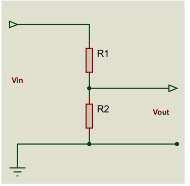

TALLER 4. FUNCIONES
1. Escribir una función a la cual se le envían las coordenadas de 3 puntos y la función retorna
   el perímetro del triángulo que forman dichos puntos.
2. Escribir la definición de una función a la cual se le envían 2 valores flotantes y la función
   retorna el valor de la media geométrica (Consultar en internet) .entre dichos valores.
3. Escribir la definición de una función a la cual se le envía el valor de dos resistencias y un
   parámetro entero que indica como están conectadas (0 si están conectadas en serie y 1 si
   están conectadas en paralelo) y la función retorna el valor de la resistencia equivalente.
4. Escribir una función a la cual se le envía el valor de las componentes (X,Y) de dos vectores
   y la función retorna el producto punto entre dichos vectores.
5. Escribir la definición de una función a la cual se le envían 2 valores enteros y la función
   retorna el valor de MCM (mínimo común múltiplo, o número más pequeño que
   simultáneamente es divisible por los 2 valores).
   int x=30,y=45,m;
   m=MCM(x,y);
   printf(“El MCM entre 30 y 45 es %d”,m);
   //en pantalla aparecería el mensaje El MCM entre 30 y 45 es 90
6. Escribir una función a la cual se le envía el valor de Vin, R1 y R2 y la función retorna el
   valor de Vout.

7. Escribir una función en Arduino a la cual se le envíe el número de un pin análogo y la
   función retorne el VOLTAJE (un valor de 0 a 5.0) que hay en dicho pin.
   Un ejemplo de uso de la función podría ser:  
   float v;  
   v=LeerVoltaje(A2); 
   Serial.println(v); //en el monitor seria debería verse un valor como 3.2 (si el voltaje

//aplicado en el pin A2 es 3.2 voltios

8. Un número es perfecto si es igual a la suma de sus divisores. Por ejemplo, el número 6 es perfecto
   porque 1+2+3=6. Pero el 15 no es perfecto porque 1+3+5=8 (no es 15). Definir la función:  
   int esPerfecto(int valor);  
   Que retorna 1 si valor es un numero perfecto y 0 si no lo es.  
   Escribir un programa que pida un número y el programa muestre todos los números perfectos
   que hay de 1 hasta dicho valor.  
   Un ejemplo de ejecución del programa podría ser: 
   Digite un valor 40  
   Los números perfectos entre 1 y 40 son: 6, 28.
9. Escribir una función a la cual se le envía un valor entero y la función muestra la
   representación binaria de dicho valor.